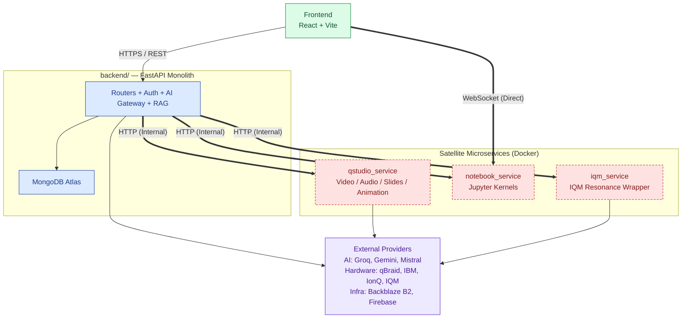
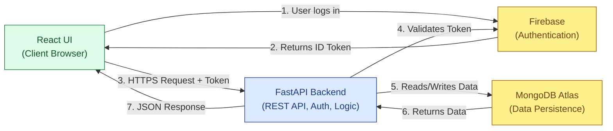

# Qrious - Project Overview

## 1. Project Overview
Qrious is an interactive, educational, and visualization tool designed to make learning quantum computing engaging and accessible. Built as a single-page application (SPA) with a FastAPI monolithic backend and several isolated satellite microservices, it bridges the gap between quantum theory and practical execution. It offers interactive quantum circuit simulations, AI-powered tutoring grounded in verified resources, gamified learning, cinematic video and document delivery, and the ability to submit quantum jobs to real quantum hardware providers.

## 2. Architecture Diagrams

### Full System Architecture



### Frontend - Backend - Database Connection Flow



## 3. Feature Analysis & Implementation (Frontend-Backend-DB)

### 3.1 Gate Playground (Circuit Builder & Simulator)
**Overview:** An interactive drag-and-drop workspace where students can construct multi-qubit quantum circuits and see simulations in real-time (probabilities, statevectors).
*   **Frontend:** `CircuitCanvas.tsx`, `GateTray.tsx`, `HistogramChart.tsx` allow building the circuit and rendering results using Recharts and React Three Fiber (for Bloch Sphere).
*   **Backend:** `qiskit_service.py` receives the JSON representation of the circuit, builds a `qiskit.QuantumCircuit`, and runs it via `Qiskit Aer` to generate statevectors and measurement histograms.
*   **DB/Storage:** Circuits are persisted to `saved_circuits` in MongoDB Atlas with their user IDs for later retrieval.

### 3.2 Code Playground
**Overview:** A safe, sandboxed environment for students to write Python/Qiskit code and see execution results, simulating real quantum development.
*   **Frontend:** Uses Monaco Editor (`MonacoEditorPanel.tsx`) for code editing with syntax highlighting.
*   **Backend:** `code_execution_service.py` safely evaluates the submitted Python code in a restricted scope containing only `qiskit` and `numpy`.
*   **DB/Storage:** Snippets are saved into the `code_snippets` collection in MongoDB.

### 3.3 Quantum Algorithm Explorer
**Overview:** A catalog of canonical quantum algorithms (e.g., Grover's, Shor's) providing theory, complexity data, and interactive demonstrations.
*   **Frontend:** Displays grids of algorithms (`AlgorithmCard.tsx`) and renders detailed markdown theory (`TheoryPanel.tsx`). Interactive demos embed the `CircuitCanvas`.
*   **Backend:** Reads the predefined algorithm list, and runs simulation via `qiskit_service` when a demo is requested.
*   **DB/Storage:** Fetches content from the `algorithm_catalog` MongoDB collection.

### 3.4 AI Tutor (RAG-Grounded Q&A)
**Overview:** A context-aware chatbot that helps students understand quantum circuits, explain gates, and detect mistakes, grounded purely on verified educational resources.
*   **Frontend:** Chat interface (`AiTutorPanel.tsx`) and context buttons ("Explain this gate").
*   **Backend:** Uses the Multi-AI Gateway and LangChain. It takes the question and circuit context, performs a similarity search over vector stores (ChromaDB), and structures a prompt for the LLM (e.g., Groq) to generate an answer.
*   **DB/Storage:** Vector embeddings are stored in ChromaDB. Chat histories are saved in MongoDB (`ai_chat_history`).

### 3.5 qBook (Notebook Code Playground)
**Overview:** A personal, multi-cell notebook environment executing real Python and Qiskit interactively, cell by cell.
*   **Frontend:** Monaco-based cell editors interacting directly with the Notebook service via WebSockets.
*   **Backend:** A separate Dockerized service (`notebook_service`) runs `ipykernel` instances for execution. The main FastAPI backend handles notebook metadata and cell persistence.
*   **DB/Storage:** Notebook data (cells, titles) are stored in MongoDB via the main API.

### 3.6 qStudio (Multimedia Educational Output)
**Overview:** Generates educational content such as Briefing Docs, Mind Maps, Flashcards, and narrated Video/Animation summaries from study materials.
*   **Frontend:** Interfaces to generate and consume different output types (PDF viewers, Video players).
*   **Backend:** Simple text/JSON outputs are generated via FastAPI + AI Gateway. Video and Animation generation are offloaded to `qstudio_service`, which orchestrates `Playwright`, `Manim`, `edge-tts`, and `ffmpeg`.
*   **DB/Storage:** Stores output metadata in `qstudio_outputs` (MongoDB) and media files in Backblaze B2 via Firebase Storage paths.

### 3.7 QRoute (Multi-Provider Hardware Job Composer)
**Overview:** Compose a quantum circuit and execute it on real quantum hardware across providers (IBM, IonQ, qBraid, IQM).
*   **Frontend:** Provides a unified interface to select devices by modality.
*   **Backend:** Maps requests to specific provider APIs using adapters (`IbmAdapter`, `IonqAdapter`, etc.). The `iqm_service` runs in isolation to avoid Qiskit version conflicts.
*   **DB/Storage:** Jobs and results are logged into `quantum_hw_jobs` in MongoDB.

---

## 4. Setup and Run Instructions

### Prerequisites
*   **Node.js** (v18+)
*   **Python 3.9+**
*   **MongoDB** (Local instance or MongoDB Atlas)
*   **Firebase** project (for authentication)
*   **Docker** (required only for running local satellite services like qStudio, qBook, IQM)

### 1. Frontend Setup
Open a terminal and execute:
```bash
cd frontend
npm install
npm run dev
```

### 2. Backend (FastAPI Monolith) Setup
Open a new terminal and execute:
```bash
cd backend
python -m venv venv

# Activate virtual environment
# Windows:
.\venv\Scripts\Activate
# macOS / Linux:
# source venv/bin/activate

pip install -r requirements.txt
```
Copy `.env.example` to `.env` inside `backend/` and populate it with your MongoDB URI, Firebase credentials, Backblaze B2, and LLM API keys.
```bash
uvicorn main:app --reload
```

### 3. Satellite Services Setup (Optional / Docker-based)
If you need to work on **qStudio**, **qBook**, or **IQM Resonance**, they must be run via Docker as they require isolated dependencies.

**For qStudio Service:**
```bash
cd qstudio_service
cp .env.example .env
# Fill in required API keys (e.g., GROQ_API_KEY, B2 keys, and a random QSTUDIO_SERVICE_SECRET)
docker compose up --build -d
```
*Note: Ensure you add `QSTUDIO_SERVICE_URL=http://localhost:8080` and `QSTUDIO_SERVICE_SECRET` to your main `backend/.env` file.*

Follow a similar pattern (`docker compose up --build -d`) for `notebook_service` (port 8081) and `iqm_service` (port 8082) using their respective `.env` files.
