# Qrious - AI Quantum Computing Tutor

[](https://react.dev)
[](https://www.typescriptlang.org)
[](https://fastapi.tiangolo.com)
[](https://www.python.org)
[](https://www.ibm.com/quantum/qiskit)
[](https://www.mongodb.com/atlas)
[](https://www.docker.com)
[](https://vercel.com)
[](https://firebase.google.com)

Qrious is an interactive, education and visualization tool designed to make learning quantum computing engaging and accessible. It was built for the Quant-A-Thon.

## Features

### Educational Experience
- **Interactive Quantum Simulations:** Visualize and run quantum circuits right in your browser.
- **AI-Powered Tutor:** Get instant answers to your quantum computing questions, grounded in verified quantum resources.
- **Gamified Learning:** Earn badges, maintain learning streaks, and complete assessments to track your progress.
- **Modern UI:** A premium, dynamic interface with dark mode and smooth animations.
- **qBook Notebook Playground:** A personal, multi-cell notebook environment for running real Python and Qiskit code interactively, cell by cell — see [Architecture](#qbook--notebook-code-playground) below.

### Media & Content Delivery
- **Cinematic Video Player:** Integrated robust HTML5 Video player with intelligent auto-retry logic for gracefully handling expiring presigned URLs during long-running lecture sessions.
- **Dedicated Resource Viewers:** Seamless, immersive full-screen viewer pages for both video and PDF documents that open in new tabs, allowing students to multitask without losing their library context.
- **Unified PDF Document Pipeline:** Enforced a streamlined PDF-only flow for presentations, notes, and cheat sheets with strict frontend and backend validation, eliminating the need for heavy, failure-prone document conversion pipelines.
- **Interactive Inline PDF Reader:** Embedded a fast, paginated document reader using `react-pdf`, complete with intuitive navigation and direct-to-disk download capabilities.

### Quantum Hardware Access
- **QRoute — Multi-Provider Job Composer:** Build a circuit once and submit it to real quantum hardware across multiple vendors (qBraid, IBM Quantum Cloud, IonQ, and IQM Resonance), grouped by physical qubit modality (superconducting, trapped-ion, etc.) rather than by vendor name. See [Architecture](#iqm-resonance-service-qroute) below for how the IQM Resonance integration is wired in as an isolated microservice.

### Infrastructure & Security
- **Secure Cloud Storage:** Powered by Backblaze B2 with time-limited presigned URLs dynamically scoped to resource types (6 hours for videos, 1 hour for documents).
- **Hardened CORS Policies:** Strict B2 storage policies ensuring sensitive educational materials can only be accessed directly from the Qrious platform.
- **Educator Upload Dashboard:** A resilient, progress-tracking React upload suite for educators to easily categorize, validate, and securely publish content to the quantum library.
- **Reliable SPA Routing:** Perfected deployment routing rules (`vercel.json`) to guarantee smooth hard-refreshes on deep application links like dedicated viewer pages.

## Landing

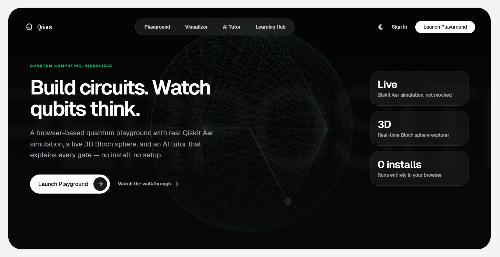

## Contents

- [Architecture](#architecture)
  - [System Overview](#system-overview)
  - [Multi-AI Gateway](#multi-ai-gateway)
  - [qStudio — Video Overview](#qstudio--video-overview)
  - [qStudio — Animation Overview (Manim)](#qstudio--animation-overview-manim)
  - [qStudio — Source-Grounded Q&A (RAG)](#qstudio--source-grounded-qa-rag)
  - [qStudio — Simple Outputs](#qstudio--simple-outputs)
  - [qBook — Notebook Code Playground](#qbook--notebook-code-playground)
  - [QRoute — Multi-Provider Job Composer](#qroute--multi-provider-job-composer)
  - [IQM Resonance Service (QRoute)](#iqm-resonance-service-qroute)
  - [Quantum Learning Path Optimizer (QAOA)](#quantum-learning-path-optimizer-qaoa)
  - [Realistic AerSimulator Noise (Opt-in)](#realistic-aersimulator-noise-opt-in)
- [Shipped Features Checklist](#shipped-features-checklist)
- [Tech Stack](#tech-stack)
- [Local Setup](#local-setup)
- [Deployment](#deployment)

## Architecture

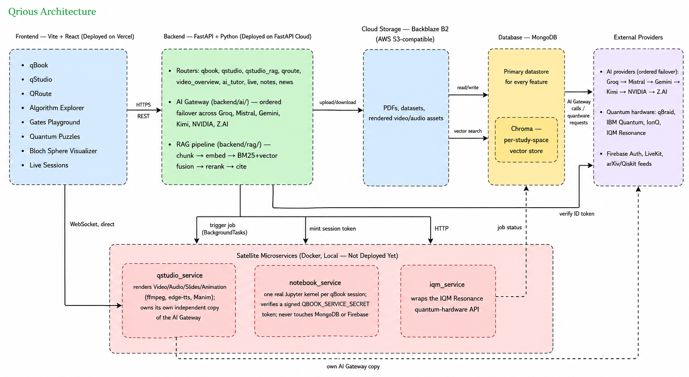

### System Overview

One React SPA, one FastAPI monolith, three isolated satellite microservices (Docker, local-only), and a failover-aware AI gateway sitting in front of six LLM providers. Everything below drills into one box at a time — this is the map.

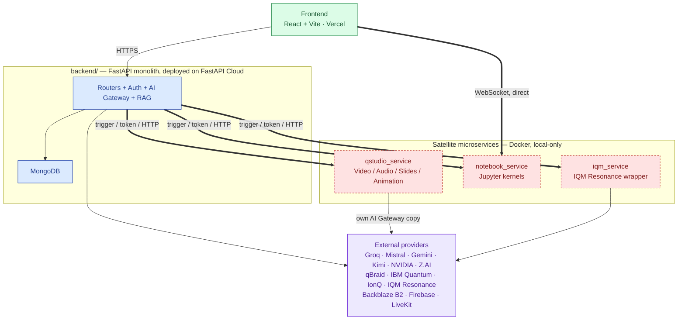
*🟩 frontend · 🟦 deployed API · 🟥 local Docker, not cloud-deployed · 🟪 external provider*

### Multi-AI Gateway

Every LLM call in Qrious — AI tutor chat, Mind Map/Flashcards/Briefing Doc generation, Video/Audio Overview scripting, Slides deck generation — goes through one provider-agnostic gateway rather than calling any single AI vendor directly. See [`docs/AI_GATEWAY.md`](./docs/AI_GATEWAY.md) for the full architecture, and [`PLANS/ai-provider-resilience.md`](./PLANS/ai-provider-resilience.md) for the research behind why this exists.

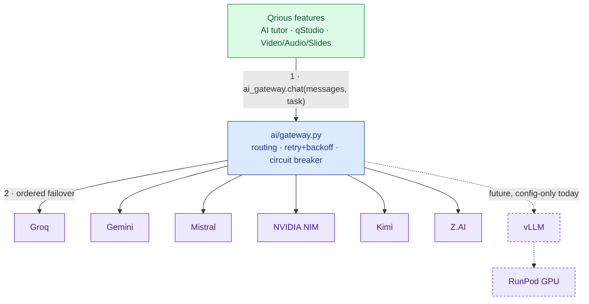
*🟩 caller · 🟦 gateway · 🟪 provider (dashed = not wired up yet)*

A rate limit, quota exhaustion, or outage on one provider fails over automatically to the next configured one — no feature code branches on provider name, and no provider is hardwired as "the" AI backend. `backend/ai/` and `qstudio_service/ai/` are two independent copies of the same provider-agnostic package (mirroring this repo's satellite-microservice isolation pattern — `qstudio_service`, `notebook_service`, `iqm_service` — see below), since `qstudio_service` never shares code with `backend/`.

### qStudio — Video Overview

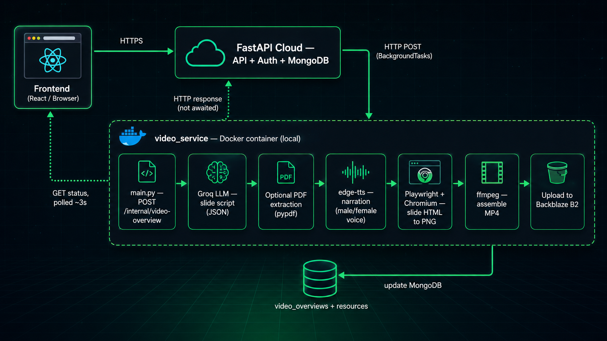

An AI-generated, narrated slide-deck video overview feature (NotebookLM-style) — before generating, the user picks a **slide template** (Minimal Dark, Bold Gradient, or Academic Light) and a **narrator voice** (male or female), implemented as **two fully independent codebases** — the main API (`backend/`) and `qstudio_service/`, a top-level sibling of `backend/` and `frontend/` — sharing nothing but a MongoDB database and a B2 bucket. `qstudio_service` (renamed from `video_service` once it grew beyond just video — see below) has its own `requirements.txt`, its own Dockerfile, and its own trimmed copies of `database.py`/`storage_service.py`/`groq_service.py`, specifically so the rendering dependencies (Playwright/Chromium, ffmpeg, Manim) never ship inside the same image as Qiskit/ChromaDB/sentence-transformers. See [`PLANS/video-overview-generator.md`](./PLANS/video-overview-generator.md) for the full design and [`DEPLOYMENT.md`](./DEPLOYMENT.md) for how to actually run and test it.

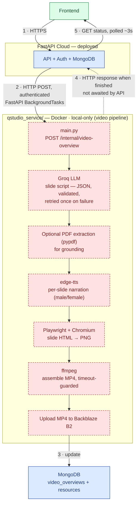
*🟦 deployed API · 🟥 local Docker, not cloud-deployed · 🟩 frontend*

The API inserts the job and returns to the frontend immediately; `qstudio_service` processes exactly one job per request, updating MongoDB as it progresses, so the frontend's status polling never talks to it directly.

Two entry points share this same pipeline:
- **Educator, lesson-scoped:** the "Generate Video Overview" dialog in `CourseEditor` (`POST /api/lessons/{lesson_id}/video-overviews`) — grounds on an existing lesson PDF, and the finished video is added to that lesson's resources.
- **Student (and educator), standalone:** a dedicated **"AI Video Overview"** tab in the dashboard sidebar (`frontend/src/pages/VideoOverviewChatPage.tsx`, routed at `/video-overview`), styled as a ChatGPT-style prompt/response interface — no lesson or course context needed. Backed by `POST /api/video-overviews` / `GET /api/video-overviews` (chat history) / `GET /api/video-overviews/{id}/view-url` — any authenticated user can use it, gated only by `get_current_user`, not `require_lesson_owner`. The resulting video isn't attached to a lesson's `resources` collection (there's none to attach to); its B2 key is read straight off the `video_overviews` doc instead.

Both entry points expose the same `template`/`voice` fields on `VideoOverviewCreate` (`backend/models/video_overview.py`), defaulting to `minimal_dark`/`female` if omitted. `template` selects which Jinja file `qstudio_service/pipeline.py` renders per slide (`qstudio_service/templates/slide.html`, `slide_bold_gradient.html`, `slide_academic_light.html`); `voice` selects the narration voice via **edge-tts** (Microsoft's free neural TTS — swapped in specifically because gTTS has no real male/female distinction), mapping to `en-US-JennyNeural` (female) or `en-US-GuyNeural` (male).

**Status:** code is fully in place (`routers/video_overview_router.py`, `models/video_overview.py`, `qstudio_service/`, `frontend/src/components/VideoOverviewGenerator.tsx`, `frontend/src/pages/VideoOverviewChatPage.tsx`) and verified end-to-end against real credentials — Groq structured-output slide-script generation, MongoDB read/write, and a full Docker build (`ffmpeg` + Playwright/Chromium install) all confirmed working. **For this MVP, `qstudio_service` runs locally via Docker rather than on a cloud host** — a deliberate call, not a gap: it was briefly deployed to Render, but the Free tier's 512MB RAM ceiling couldn't handle Chromium + `ffmpeg` running back-to-back (the container got OOM-killed mid-render). Since the Dockerfile itself is host-agnostic, moving this to any cloud provider later is a config change, not a rewrite. On the deployed site (Vercel + FastAPI Cloud), both entry points detect the production build (`import.meta.env.PROD`) and show a static "local-only feature" notice instead of the live generator, since the deployed API has nothing reachable to trigger. See [`DEPLOYMENT.md`](./DEPLOYMENT.md) for how to actually run it.

### qStudio — Animation Overview (Manim)

The 7th qStudio output type: a short narrated [Manim](https://www.manim.community/) animation built from a study space's sources — concepts, comparisons, and simple diagrams brought to life with actual motion, not another slideshow. Lives in the same `qstudio_service/` Docker container as Video/Audio/Slides, reusing its edge-tts/ffmpeg tooling. See [`PLANS/qstudio-animation.md`](./PLANS/qstudio-animation.md) for the full design.

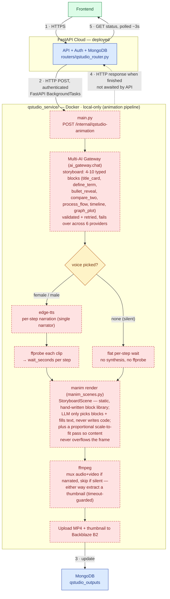
*🟦 deployed API · 🟥 local Docker, not cloud-deployed · 🟨 decision · 🟩 frontend*

Same request-driven, MongoDB-polled shape as Video/Audio/Slides above — no new architectural pattern. The one thing worth calling out: **no LLM-authored code is ever executed.** `manim_scenes.py` is a fixed, checked-in library of block-builder functions; a generation only ever produces *data* (which blocks, in what order, with what text) that gets validated against a Pydantic schema and handed to that static code — there's no `exec()`, no dynamically-written `.py` file, and the one field that isn't plain text (`graph_expression`, a plotted function) goes through a narrow AST allowlist rather than `eval()` of raw model output.

<details>
<summary>A few things hardened after the initial build, worth knowing if you touch this code</summary>

- **Voice is optional.** The generate form's narrator picker includes a real "No narration (silent)" choice, not just a default — `AnimationTrigger.voice` is `Optional[str]`, and omitting narration skips edge-tts/ffprobe/muxing entirely, pacing each step with a flat `SILENT_STEP_SECONDS` instead (an earlier word-count-based estimate produced 5+ minute videos and was replaced). **Regenerating an existing animation reopens this same voice-picker form** rather than immediately re-running with the previous settings, matching Video Overview's own regenerate UX.
- **Content can't overflow the frame.** Every block builder runs its assembled content through a `_fit()` safety net that proportionally scales the whole group down (never distorting) if it exceeds the real Manim frame bounds — found via a live `process_flow` render that summed wider than the frame despite each individual label being short.
- **Multi-line bullets indent correctly.** Wrapped bullet text uses `textwrap`'s hanging-indent (`initial_indent`/`subsequent_indent`) so continuation lines fall under the first line's text, not flush against the bullet marker.
- **`qstudio_service` is a separate Docker container that does not hot-reload** — same as `notebook_service`/`iqm_service`. Every change under `qstudio_service/` (including the three fixes above) only takes effect after `docker compose up --build`; a stale, un-rebuilt container is the first thing to check if a fix "isn't working" or a request that should validate is unexpectedly rejected.

</details>

**Status:** all seven block types (`title_card`, `define_term`, `bullet_reveal`, `compare_two`, `process_flow`, `timeline`, `graph_plot`) implemented and render-verified with real Manim CE 0.20.1, individually and as combined multi-step storyboards. Both narrated and silent generation paths verified end-to-end, including a real 7-step/28-animation combined render. Frontend (`AnimationOverviewGenerateForm.tsx`, `AnimationOverviewOutputCard.tsx`) type-checks clean and follows the same generate-form/output-card/regenerate pattern as the other six qStudio output types.

### qStudio — Source-Grounded Q&A (RAG)

A NotebookLM-style "ask your sources" chat, scoped per study space, grounded in the same PDF/text sources the other six qStudio outputs already read from — lives entirely in `backend/` (`rag/`, `routers/qstudio_rag_router.py`), not `qstudio_service/`, since study spaces/sources have always been owned by `backend/` and `qstudio_service` has no source access of its own. See [`PLANS/qstudio-rag.md`](./PLANS/qstudio-rag.md) for the full design, including why this is a genuinely separate per-study-space Chroma index rather than a reuse of the AI tutor's existing single global `quantum_docs` collection (`services/chroma_service.py`).

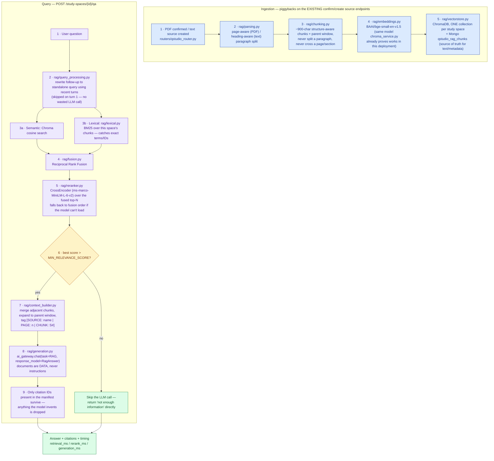
*🟦 ingestion step · 🟪 query step · 🟨 decision · 🟩 final result*

<details>
<summary>A few things worth knowing</summary>

- **Ingestion never blocks the existing upload flow.** Indexing runs as a `BackgroundTasks` job triggered right after the existing PDF-confirm/text-create endpoints finish — no new manual "ingest" call, one place text enters the system. A `content_hash` skips re-embedding unchanged content on reindex.
- **Citations can't be fabricated by construction, not by prompt-asking alone.** The LLM only ever echoes a server-assigned `S#` ID from the context manifest handed to it; any ID it invents that isn't in that manifest is filtered out before the response reaches the frontend.
- **Prompt-injection defense**: retrieved document content is wrapped in explicit `[SOURCE: ...]` blocks inside the *user* message — the system prompt (the only source of behavioral rules) explicitly tells the model that text inside those blocks is reference material to quote from, never an instruction to follow, even if it reads like one.
- **A confidence gate skips the LLM call entirely** when nothing relevant was retrieved, returning a canned "not enough information" response — cheaper and more honest than asking the model to write around empty evidence.
- **Evaluation**: `python -m rag.eval <study_space_id> <owner_uid> [cases.json]` — a lightweight harness (not a labeled benchmark; none exists for QStudio yet) covering the 7 representative query categories from the design doc, useful for sanity-checking `rag/config.py`'s thresholds after a change.

</details>

**Status:** backend fully wired (ingestion hook, hybrid retrieval, reranking, grounded generation, citation mapping, chat history persistence) and import/route-registration verified against the real FastAPI app. Frontend chat panel (`SourceChatPanel.tsx`) replaces the Workspace pane's empty state — matching NotebookLM's own "chat is the default view" layout — with a source-filter chip row, citation chips per answer, and conversation persistence across reloads. New dependency: `rank-bm25` (pure Python, no native build). Not yet run against a real ingested study space with real provider credentials in this environment — see `PLANS/qstudio-rag.md` §5 for what's deliberately deferred (DOCX/URL sources, a hosted reranker, BM25 caching).

### qStudio — Simple Outputs

Five of qStudio's nine output types are a single synchronous call — no background job, no MongoDB polling, no generate-config form. Pick the card in Studio and the AI Gateway call happens inline in the request/response cycle:
- **Mind Map** — node/edge graph, opens in a full-screen pan/zoom modal
- **Flashcards** — spaced-repetition review (XP, ease factor, next-review scheduling)
- **Briefing Doc** — overview + key topics + glossary
- **Study Guide** — short-answer quiz + suggested essay questions + glossary of key terms
- **Blog Post** — source material's takeaways distilled into a readable article

All five share one dispatch function (`create_output`'s `if`/`elif` ladder in `routers/qstudio_router.py`) and one request/response shape — the only thing that changes per type is which Pydantic `response_model` and system prompt gets handed to the AI Gateway.

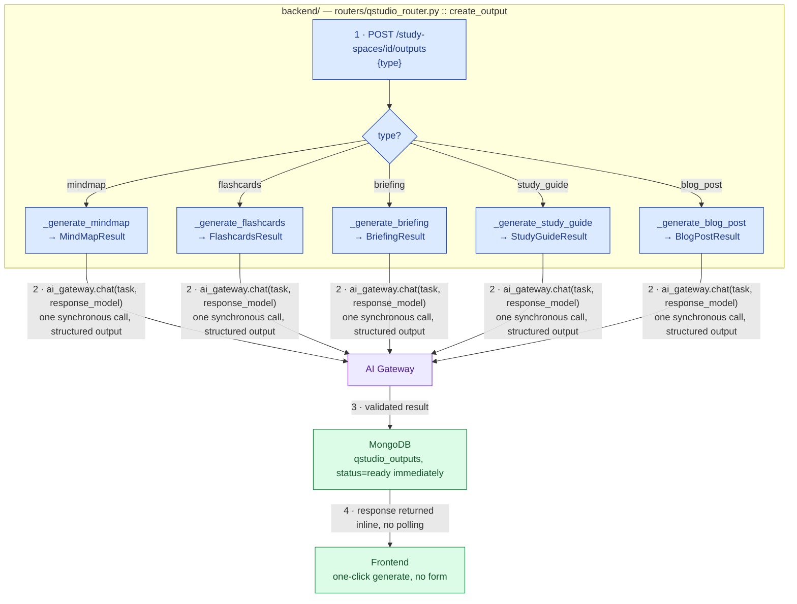
*🟩 frontend/result · 🟦 API dispatch · 🟪 AI Gateway*

**Status:** all five implemented and wired into `StudioPanel`/`QStudioStudySpacePage` identically — same card grid, same one-click generate (`handleSelect`'s fallback branch), same regenerate flow. Briefing Doc, Study Guide, and Blog Post each ship a `jsPDF` "Download PDF" button; Mind Map and Flashcards use dedicated interactive viewers instead (a pan/zoom modal and a spaced-repetition reviewer, respectively).

### qBook — Notebook Code Playground

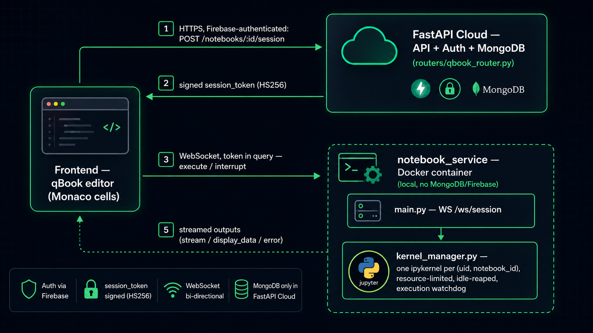

A personal, multi-cell notebook environment where any student runs real Python and Qiskit interactively, cell by cell, with results (text, plots, circuit diagrams) rendered inline. Like qStudio's rendering pipeline, this is **two independent codebases** — `backend/` and a new top-level `notebook_service/`, sibling to `backend/`, `frontend/`, and `qstudio_service/` — but split along a different line: `notebook_service` owns **no database connection of any kind**, not MongoDB, not Firebase. It only manages ephemeral `ipykernel` processes. All notebook content (cells, outputs, titles) is CRUD'd through `backend/` exactly like everything else, and the frontend connects to `notebook_service` **directly** over WebSocket using a short-lived signed token — kernel traffic is never proxied through the API, since that would double every round trip for something this latency-sensitive. See [`PLANS/qbook.md`](./PLANS/qbook.md) for the full design.

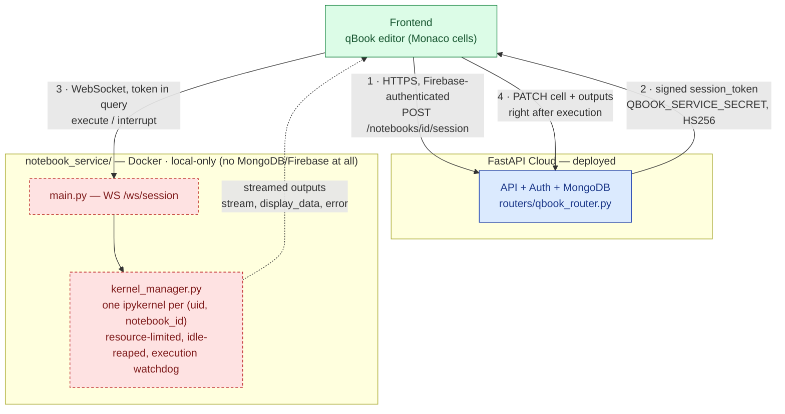
*🟦 deployed API · 🟥 local Docker, not cloud-deployed · 🟩 frontend*

`backend/` never calls `notebook_service` over HTTP — it only mints the token. `notebook_service` never touches MongoDB or Firebase — it only verifies a signature. Each side does exactly one thing, and the frontend is the only party that talks to both.

**Status:** code is fully in place (`notebook_service/`, `backend/routers/qbook_router.py`, `backend/models/notebook.py`, `frontend/src/modules/qbook/`) — backend imports clean (including a live FastAPI `openapi()` route-resolution check) and the frontend type-checks clean. It has **not** been run end-to-end against a real kernel yet — that needs Docker and the `qiskit`/`qiskit-aer`/`ipykernel` install, neither available in the environment this was built in. See [`PLANS/qbook.md`](./PLANS/qbook.md) §5 for the verification steps to run once Docker is available locally. **Runs locally via Docker only for this MVP**, the same posture `qstudio_service` is in — the Dockerfile is host-agnostic, so a real cloud deploy later is a config change, not a rewrite. On the deployed site, the qBook pages detect the production build (`import.meta.env.PROD`) and show a static "local-only feature" notice instead of the live editor — same mechanism as the qStudio Video Overview feature's `VideoServiceLocalOnlyNotice`.

### QRoute — Multi-Provider Job Composer

Build a circuit once and submit it to real quantum hardware across vendors, grouped in the UI by physical qubit modality rather than by vendor name. `routers/qroute_router.py` never talks to a provider's SDK directly — every provider is a `QuantumProviderAdapter` in `services/quantum_providers/PROVIDER_REGISTRY`, registered unconditionally (even without credentials) so `GET /providers` can show the full roadmap with an honest "not configured" status rather than silently omitting unbuilt ones.

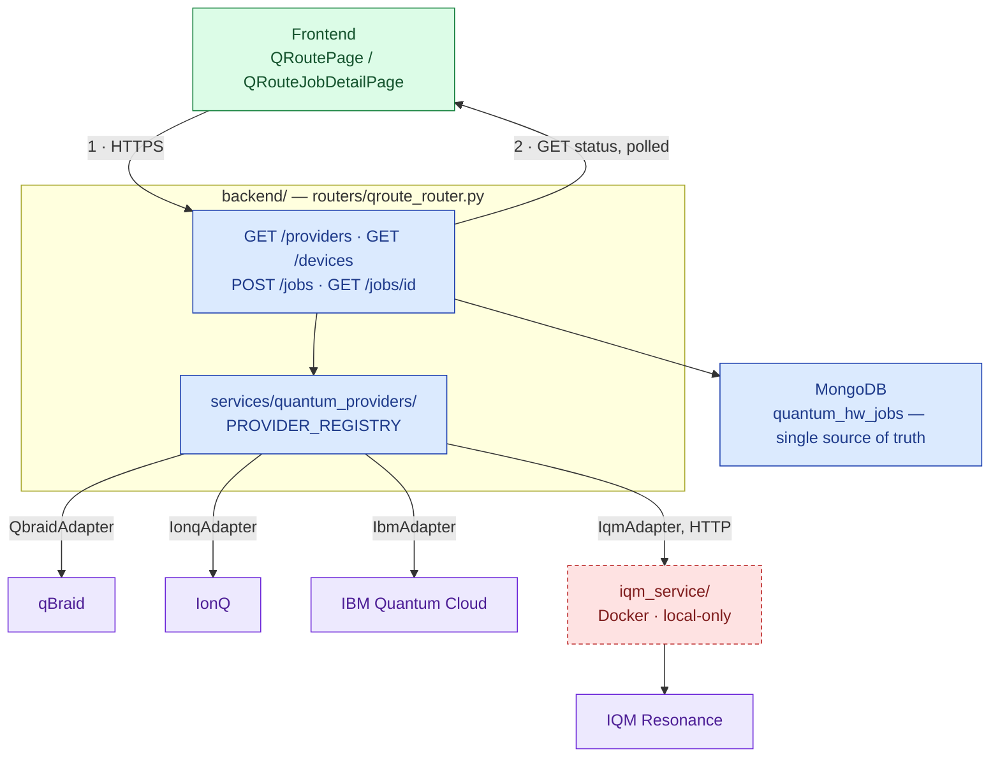
*🟩 frontend · 🟦 deployed API · 🟥 local Docker, not cloud-deployed · 🟪 external hardware*

Three of the four adapters (qBraid, IonQ, IBM) call their provider's cloud API directly from `backend/`; IQM is the odd one out — its SDK needs its own `qiskit` line that clashes with `qiskit-ibm-runtime`/`qiskit-ionq` already in `backend/`'s shared venv, so `IqmAdapter` makes an HTTP call to the standalone `iqm_service/` instead of importing anything IQM-specific. See below for that service.

### IQM Resonance Service (QRoute)

`iqm_service/` is a standalone, Dockerized microservice — sibling to `qstudio_service/` and `notebook_service/` — that owns the **IQM Resonance** integration for QRoute, `backend/`'s multi-provider quantum job composer (`routers/qroute_router.py`, `services/quantum_providers/`). It exists purely to solve a dependency conflict: IQM's SDK needs its own `qiskit` line, which clashes with `qiskit-ibm-runtime`/`qiskit-ionq` (both need `qiskit>=2.0`) already installed in `backend/`'s shared venv — the same class of problem `qstudio_service` (Playwright/ffmpeg, Manim) and `notebook_service` (a live Jupyter kernel) already solved by getting their own process instead of sharing `backend/`'s environment. Notably, the SDK actually used is **`iqm-client[qiskit]`**, not `qiskit-iqm` as originally planned — `qiskit-iqm` turned out to be a dead end, raising `RuntimeError` at import time for any Resonance use (confirmed by actually installing it), with IQM pointing users at `iqm-client[qiskit]` as its replacement.

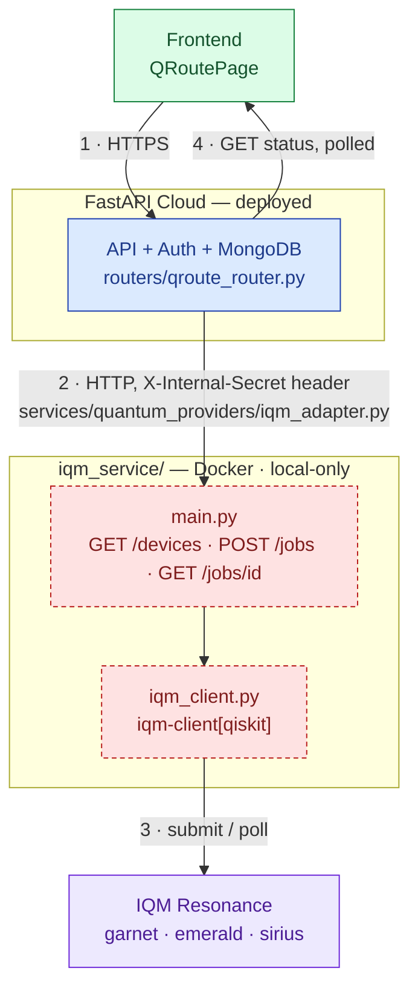
*🟦 deployed API · 🟥 local Docker, not cloud-deployed · 🟪 external hardware · 🟩 frontend*

Like `notebook_service`, `iqm_service` owns **no database connection of any kind** — it has nothing to persist. `backend/`'s `quantum_hw_jobs` collection remains the single source of truth for job records; `iqm_service` is purely a stateless translator to and from the real IQM Resonance API, called over plain HTTP with a shared-secret header (`X-Internal-Secret` / `IQM_SERVICE_SECRET`), the same pattern `QSTUDIO_SERVICE_SECRET`/`QBOOK_SERVICE_SECRET` already establish for the other two services. `backend/.env` only ever holds `IQM_SERVICE_URL` + `IQM_SERVICE_SECRET` — the real `IQM_TOKEN` credential lives exclusively inside `iqm_service/.env` and `backend/` never sees it.

Three devices are confirmed live against a real Resonance account, each with a free `:mock` counterpart for testing the submit/poll/result path without spending real queue time:

| Device ID | Chip | Qubits | Real hardware? |
|---|---|---|---|
| `garnet` | IQM Garnet | 20 | Yes |
| `emerald` | IQM Emerald | 54 | Yes |
| `sirius` | IQM Sirius | 16 | Yes |
| `garnet:mock` / `emerald:mock` / `sirius:mock` | — | 20 / 54 / 24 | No — free, no queue time, random-bit test endpoint |

**Status:** fully built and registered in `backend/services/quantum_providers/__init__.py`'s `PROVIDER_REGISTRY` — IQM Resonance shows up in QRoute's device picker automatically, no IQM-specific frontend code needed (`QRoutePage`/`QRouteJobDetailPage` render whatever the registry reports generically). **Runs locally via Docker only for this MVP** (port `8082`, following `qstudio_service`'s `8080`/`notebook_service`'s `8081` convention), not yet deployed to a cloud host — same posture as the other two services, and for the same reason: the Dockerfile is host-agnostic, so a real cloud deploy later is a config change, not a rewrite. One thing to budget for if that happens: `iqm-client[qiskit]` pulls in `pandas`/`xarray`/`opentelemetry`/`iqm-pulse` as mandatory dependencies, making this image noticeably larger than `qstudio_service`'s. See [`PLANS/iqm-service.md`](./PLANS/iqm-service.md) for the full design rationale and [`iqm_service/DEPLOYMENT.md`](./iqm_service/DEPLOYMENT.md) for how to actually run it.

### Quantum Learning Path Optimizer (QAOA)

"What should I study next?" across a 93-topic roadmap is a knapsack problem — pick the subset of weak/unlocked topics that maximizes learning value inside a fixed study-session time budget. QAOA can express that optimization directly on a quantum circuit, but a single qubit per topic means 93 qubits — a 2⁹³-dimensional state space, hopelessly infeasible for `AerSimulator` (or any simulator). So this is a deliberate **two-stage pipeline**: a cheap classical pass does the heavy filtering first, and QAOA only ever runs on the small remainder.

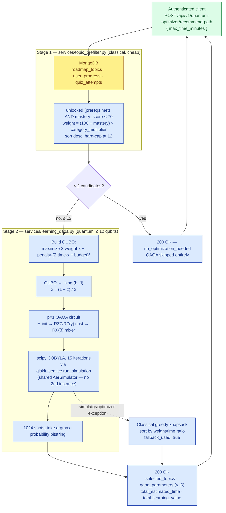
*🟩 client entry point · 🟦 backend logic · 🟨 MongoDB reads — dashed edge = exception path*

**How the QAOA circuit itself works** — zooming into Stage 2's `optimize_learning_path`, rather than the pipeline around it:

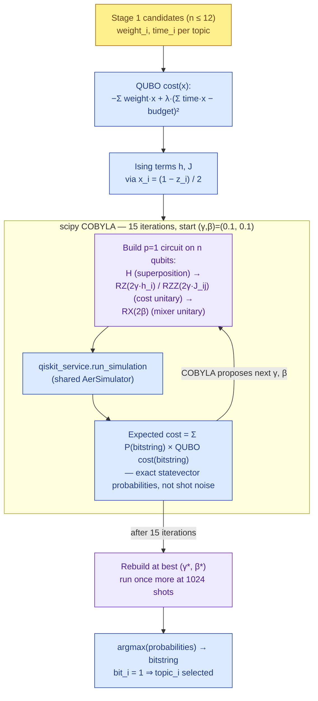
*🟨 Stage 1 input · 🟪 quantum circuit step · 🟦 classical computation*

Two things worth noting: the optimization loop scores each `(γ, β)` guess using the circuit's **exact** probability distribution (cheap at ≤12 qubits) rather than sampling shots, which keeps a 15-iteration classical search stable; and only the *final* accepted parameters get a real 1024-shot measurement, since that's the one result that actually needs to look like a sampled outcome.

**Why the QUBO penalty has no slack qubits.** The time-budget constraint (`Σ time·x ≤ budget`) is normally encoded exactly with extra slack qubits, but that would push the qubit count above what Stage 1 promised (`N ≤ 12`, chosen so the whole circuit stays sub-second on `AerSimulator`). Instead the penalty term `λ·(Σ time·x − budget)²` (λ = 0.5) is applied directly on the same `N` qubits — it discourages drifting away from the budget in *either* direction, an approximation rather than an exact inequality. That's fine here: this is a shallow p=1, 15-iteration circuit whose job is to bias the sampling distribution toward good selections, and the classical greedy-knapsack fallback is what actually guarantees a feasible, materially useful answer regardless of how well QAOA converges.

**Correctness, not vibes.** The QUBO→Ising conversion is verified exhaustively in `tests/test_learning_qaoa.py` — for every bitstring of several fixture sizes, `offset + Σh·z + ΣJ·z·z` is asserted equal to the QUBO's own direct cost evaluation, not eyeballed against hand-derived coefficients. A separate test confirms `optimize_learning_path` reaches brute-force-optimal on a small fixture, and a mocked-simulator-failure test confirms the fallback path actually engages and stays within budget.

**Error handling, matching the "never 500" contract:** `< 2` candidates short-circuits before QAOA ever runs; the router re-truncates to 12 defensively even though Stage 1 already caps there, so a hypothetical Stage-1 bug can never hand Stage 2 more qubits than it's built for; any exception inside QAOA execution (simulator failure, optimizer blow-up) is caught and replaced with the greedy-knapsack result, flagged `fallback_used: true`.

**Status:** backend fully built and tested (`services/topic_prefilter.py`, `services/learning_qaoa.py`, `POST /api/v1/quantum-optimizer/recommend-path`) — no dedicated frontend panel yet, callable directly against the API.

### Realistic AerSimulator Noise (Opt-in)

`qiskit_service.run_simulation()` — the engine behind the gate-canvas Simulate button and the Bloch Sphere visualizer — ran on `AerSimulator(method='statevector')` with no `NoiseModel` at all, and its `probabilities` field came straight from the exact analytical statevector rather than sampled shots. Same circuit in, bit-for-bit identical percentages out, every time, by construction — not a bug, but not what "run this on a simulator" implies either.

Fixed as an **opt-in** flag rather than a default change: `qcompare_service.run_ideal()` explicitly depends on `run_simulation()` staying an exact, deterministic noiseless baseline to compute real-hardware divergence (TVD) against, so flipping the default would silently corrupt that feature's own metric.

```python
# services/qiskit_service.py
qiskit_service.run_simulation(qc, shots=1024, noisy=True)
```

With `noisy=True`, Aer samples `counts` through a synthetic `NoiseModel` (`qiskit_aer.noise`: `thermal_relaxation_error` + `depolarizing_error` per gate, `ReadoutError` on measurement) built with realistic NISQ magnitudes and applied **uniformly to every qubit** — deliberately not `NoiseModel.from_backend(...)`, since a real device's noise is keyed to its specific coupling map and this platform's gate canvas lets a user connect any two qubits freely; a topology-constrained model would look noisy on "connected" pairs and silently clean on "unconnected" ones. `probabilities`/`statevector` stay exact (Aer's noise only perturbs the sampled shots, not the saved statevector operation) — `counts` is the field that now actually varies run-to-run and diverges from the ideal distribution.

| Parameter | Value |
|---|---|
| T1 / T2 | 100µs / 80µs |
| 1-qubit / 2-qubit gate time | 50ns / 300ns |
| 1-qubit / 2-qubit depolarizing error | 0.05% / 1% |
| Readout error | 1.5% |

**Status:** built and tested (`tests/test_qiskit_service_noise.py` — confirms the default path stays exactly noiseless, and that `noisy=True` measurably leaks probability into states an ideal Bell pair never produces). Wired through `SimulationRequest.noisy` on `POST /api/v1/simulate`; no frontend toggle yet.

## Shipped Features Checklist

A running record of what's actually built and verified, not just planned. Check the linked design doc / architecture section for status detail, caveats, and how to run each piece locally.

### Core Platform
- [x] Interactive quantum circuit simulations (Qiskit + Qiskit Aer, OpenQASM support)
- [x] [Opt-in realistic hardware noise simulation](#realistic-aersimulator-noise-opt-in) — synthetic `NoiseModel` (thermal relaxation + depolarizing + readout error), default stays exactly noiseless
- [x] AI tutor chat, grounded via RAG (LangChain + ChromaDB + BAAI/bge-small-en-v1.5)
- [x] Gamified learning — badges, streaks, assessments
- [x] Cinematic video player with expiring-URL auto-retry
- [x] Dedicated full-screen video/PDF viewer pages
- [x] Inline paginated PDF reader (`react-pdf`)
- [x] Educator upload dashboard (categorize/validate/publish to the quantum library)
- [x] Secure B2 storage with resource-scoped presigned URL TTLs

### QRoute — Multi-Provider Quantum Job Composer
- [x] [Circuit-once, submit-anywhere composer](#qroute--multi-provider-job-composer) across qBraid, IBM Quantum Cloud, IonQ
- [x] [IQM Resonance integration](#iqm-resonance-service-qroute) (`iqm_service/`) — `garnet` (20q), `emerald` (54q), `sirius` (16q), all live, plus free `:mock` counterparts for each

### qStudio — Study Space AI Outputs
Nine output types in two families — [five one-shot synchronous types](#qstudio--simple-outputs) and four request-driven, MongoDB-polled types (`routers/qstudio_router.py` + `qstudio_service/`) — plus source-grounded Q&A:
- [x] [Mind Map](#qstudio--simple-outputs)
- [x] [Flashcards](#qstudio--simple-outputs) (with spaced-repetition review — XP, ease factor, next-review scheduling)
- [x] [Briefing Doc](#qstudio--simple-outputs) (overview + key topics + glossary)
- [x] [Study Guide](#qstudio--simple-outputs) (short-answer quiz + suggested essay questions + glossary)
- [x] [Blog Post](#qstudio--simple-outputs) (source material's takeaways distilled into a readable article)
- [x] Audio Overview (two-host narrated podcast, 6-voice catalog)
- [x] Slides (3 themes: Minimal Dark, Bold Gradient, Academic Light)
- [x] [Video Overview](#qstudio--video-overview) — also has a standalone, lesson-independent chat-style entry point at `/video-overview`
- [x] [Animation Overview](#qstudio--animation-overview-manim) (Manim) — 7 block types, optional narration, canvas-overflow and bullet-alignment hardening done
- [x] [Source-Grounded Q&A](#qstudio--source-grounded-qa-rag) (RAG) — NotebookLM-style chat per study space: structure-aware chunking, hybrid BM25+semantic retrieval, cross-encoder reranking, grounded generation with server-verified citations. Backend fully wired and verified; not yet run against a real ingested study space with live provider credentials — see `PLANS/qstudio-rag.md` §5 for deferred scope (DOCX/URL sources, hosted reranker)

### qBook — Notebook Code Playground
- [x] Multi-cell Python/Qiskit notebook, real `ipykernel` execution, inline text/plot/circuit-diagram output
- [x] Direct frontend↔`notebook_service` WebSocket (kernel traffic never proxied through the API)
- [ ] End-to-end verification against a real kernel (needs Docker + `qiskit-aer`/`ipykernel`, not yet run — see [`PLANS/qbook.md`](./PLANS/qbook.md) §5)

### Quantum Learning Path Optimizer
- [x] [Two-stage pipeline](#quantum-learning-path-optimizer-qaoa) — classical pre-filter (`topic_prefilter.py`) caps candidates at 12 before QAOA ever builds a circuit
- [x] `POST /api/v1/quantum-optimizer/recommend-path` — 1-layer QAOA on the shared `qiskit_service` `AerSimulator`, COBYLA(15) parameter optimization
- [x] Classical greedy-knapsack fallback on any simulator/optimizer failure — endpoint never 500s on Stage 2
- [x] QUBO→Ising conversion verified exhaustively against direct QUBO cost evaluation, not eyeballed (`tests/test_learning_qaoa.py`)
- [ ] Frontend recommendation panel — backend only for now, callable directly against the API

### Infrastructure
- [x] Multi-AI Gateway — provider-agnostic LLM routing (Groq, Gemini, Mistral, NVIDIA NIM, Kimi, Z.AI) with retry, backoff, and circuit breaker; used by every LLM call in the platform
- [x] Hardened CORS + B2 storage policies
- [x] SPA deep-link routing fixes (`vercel.json`)
- [ ] Cloud deploy for `qstudio_service` / `notebook_service` / `iqm_service` — all three currently run **locally via Docker only**; Dockerfiles are host-agnostic so this is a config change, not a rewrite, when it happens

## Tech Stack

- **Frontend:** React, TypeScript, Tailwind CSS, Shadcn UI, Magic UI, React Bits, React Three Fiber.
- **Backend:** FastAPI (Python).
- **Quantum Processing:** Qiskit, Qiskit Aer (with OpenQASM support).
- **Notebook Execution:** `ipykernel` + `jupyter_client` (`notebook_service/`) — one real Jupyter kernel per qBook session.
- **AI/RAG:** LangChain, Groq, ChromaDB, BAAI/bge-small-en-v1.5 embeddings.
- **Database:** MongoDB Atlas.
- **Auth & Storage:** Firebase Authentication, Firebase Storage.

## Local Setup

### Prerequisites

- Node.js
- Python 3.9+
- MongoDB instance (local or Atlas)
- Firebase project credentials

### Frontend Setup

Open a terminal and run the following commands to start the React frontend:

```bash
cd frontend
npm install
npm run dev
```

### Backend Setup

Open a new terminal and run the following commands to start the FastAPI backend:

```bash
cd backend
python -m venv venv
# On Windows
.\venv\Scripts\Activate
# On macOS/Linux
# source venv/bin/activate

pip install -r requirements.txt
uvicorn main:app --reload
```

`requirements.txt` installs everything the API needs — for local development this is the only file you need to install from.

#### Requirements file layout

`qstudio_service/` (top-level, alongside `backend/` and `frontend/` — renamed from `video_service/` once it grew to host Audio/Slides/Animation alongside Video) is a **fully independent deployable** — its own Docker build context, its own trimmed copies of `database.py`/`storage_service.py`/`services/groq_service.py`/`models/video_overview.py`, and its own flat `qstudio_service/requirements.txt` with no dependency on anything in `backend/`. It ships a lean image (no Qiskit/ChromaDB/Torch) without needing to share files with the API at all. See [`PLANS/video-overview-generator.md`](./PLANS/video-overview-generator.md) §1a for the full design and the tradeoff (two copies to keep in sync instead of one shared source of truth).

`backend/requirements.txt` (used by the commands above, and by FastAPI Cloud's own deploy) is a flat, self-contained list of everything the **API** needs — auth, quantum simulation, live sessions, the AI tutor RAG chat, quantum news sync. It's intentionally **not** a `-r` include to another file: FastAPI Cloud's build stages this one file in isolation during an early dependency-resolution step, before the rest of the repo — including any sibling requirements file — is copied in, so an include pointing outside itself 404s on a real deploy. `requirements-common.txt`/`requirements-api.txt` still exist alongside it as a local-dev/documentation reference for how that list breaks down, kept in sync by hand.

You only need `qstudio_service/requirements.txt` if you're working on qStudio's rendering pipeline (Video/Audio/Slides/Animation) itself. Same goes for `notebook_service/requirements.txt` and qBook, and `iqm_service/requirements.txt` and IQM Resonance, below.

### qStudio Service Setup (optional — Video/Audio/Slides/Animation rendering, runs via Docker)

`qstudio_service/` is a separate service from the API above, with its own Dockerfile — you only need this if you're working on qStudio's rendering pipeline:

```bash
cd qstudio_service
cp .env.example .env
# fill in real MONGODB_URI, B2_*, GROQ_API_KEY (same values as backend/.env), and
# make up any random string for QSTUDIO_SERVICE_SECRET

docker compose up --build -d   # or: docker build -t qrious-qstudio-service . && docker run ...
docker compose logs -f         # watch it work
```

Then add the matching `QSTUDIO_SERVICE_URL=http://localhost:8080` and `QSTUDIO_SERVICE_SECRET=<same value>` to `backend/.env` so the API can reach it. See [`DEPLOYMENT.md`](./DEPLOYMENT.md) for the full walkthrough, a lighter-weight AI-logic-only testing option (no Docker/ffmpeg/Chromium needed), and how to point an already-deployed API/frontend at a locally-running qStudio service via a tunnel.

### qBook Notebook Service Setup (optional — Python/Qiskit notebook execution, runs via Docker)

`notebook_service/` is a separate service from the API above, with its own Dockerfile — you only need this if you're working on qBook:

```bash
cd notebook_service
cp .env.example .env
# make up a random string for QBOOK_SERVICE_SECRET (e.g. `openssl rand -hex 32`)

docker compose up --build -d   # or: docker build -t qbook-notebook-service . && docker run ...
docker compose logs -f         # watch it work
```

Then add the matching `QBOOK_SERVICE_SECRET=<same value>` to `backend/.env`, and point the frontend at it via `frontend/.env`'s `VITE_QBOOK_SERVICE_URL` (defaults to `ws://127.0.0.1:8081`, matching this service's own default `PORT`). **Convention:** `notebook_service` defaults to port 8081, not 8080, everywhere — `.env`/`.env.example`, the Dockerfile's `EXPOSE`/`CMD`, and `docker-compose.yml`'s `8081:8081` mapping — specifically so it can never collide with `qstudio_service` (which defaults to 8080), whether you run it through compose, plain `docker run`, or bare `uvicorn`. Unlike `qstudio_service`, `notebook_service` never reads `backend/.env` values like `MONGODB_URI` or Firebase credentials — it has nothing to connect to there; see [`PLANS/qbook.md`](./PLANS/qbook.md) §0 for why.

### IQM Resonance Service Setup (optional — QRoute real-hardware submission to IQM, runs via Docker)

`iqm_service/` is a separate service from the API above, with its own Dockerfile — you only need this if you're working on the IQM Resonance provider in QRoute:

```bash
cd iqm_service
cp .env.example .env
# fill in the real IQM_TOKEN from your Resonance dashboard (resonance.meetiqm.com),
# and make up any random string for IQM_SERVICE_SECRET

docker compose up --build -d   # or: docker build -t qrious-iqm-service . && docker run ...
docker compose logs -f         # watch it work
```

Then add the matching `IQM_SERVICE_URL=http://127.0.0.1:8082` and `IQM_SERVICE_SECRET=<same value>` to `backend/.env` so the API can reach it. No frontend changes are needed — IQM Resonance appears in `QRoutePage`'s device picker automatically once `PROVIDER_REGISTRY` reports it configured. **Convention:** `iqm_service` defaults to port 8082 — the next free slot after `qstudio_service` (8080) and `notebook_service` (8081) in the same collision-avoidance scheme. Like `notebook_service`, it never reads `backend/.env` values like `MONGODB_URI` or Firebase credentials — it has nothing to connect to there. See [`iqm_service/DEPLOYMENT.md`](./iqm_service/DEPLOYMENT.md) for the full walkthrough, including the confirmed live device list (`garnet`/`emerald`/`sirius` plus free `:mock` counterparts).

### Running all three microservices at once

Once each of `qstudio_service/.env`, `notebook_service/.env`, and `iqm_service/.env` exists (copied from that service's own `.env.example` and filled in, per the three setups above), a single root-level [`docker-compose.yml`](./docker-compose.yml) builds and runs all three together — it doesn't replace each service's own `docker-compose.yml` (still valid for running just one), it just duplicates their config so both workflows work:

```bash
docker compose up --build -d   # from the repo root — all three services
docker compose logs -f         # watch all three at once
docker compose down            # stop all three
```

`backend/` and `frontend/` are intentionally not part of this file — they run directly via `uvicorn`/`npm run dev`, not Docker.

**Only run `up` from one of the two workflows at a time.** The root file reuses each service's exact `container_name` (`qrious-qstudio-service`, `qbook-notebook-service`, `qrious-iqm-service`) so both ways of starting a service manage the *same* container — but that also means starting it from the other workflow while one is already running hits a Docker name conflict (`Conflict. The container name "..." is already in use`). Run `docker compose down` (from whichever one you used last) before switching to the other. If you hit the conflict anyway, clear the stale containers and retry:

```bash
docker rm -f qrious-qstudio-service qbook-notebook-service qrious-iqm-service
docker compose up --build -d
```

## Deployment

- **Frontend:** Vercel (see `frontend/vercel.json` for SPA routing rules).
- **Backend API:** FastAPI Cloud — unaffected by the qStudio rendering pipeline; no extra setup beyond the `QSTUDIO_SERVICE_URL`/`QSTUDIO_SERVICE_SECRET` env vars described in `DEPLOYMENT.md`.
- **Video service:** **runs locally via Docker for this MVP** — not deployed to any cloud host yet (see [`DEPLOYMENT.md`](./DEPLOYMENT.md) for why and how). The Dockerfile is host-agnostic, so moving it to a cloud provider later needs no code changes.
- **qBook notebook service:** same posture as the video service — **runs locally via Docker for this MVP**, not deployed to any cloud host yet (see [`PLANS/qbook.md`](./PLANS/qbook.md) §4). Also host-agnostic; moving it later is a config change, not a rewrite.
- **IQM Resonance service:** same posture as the other two — **runs locally via Docker for this MVP**, not deployed to any cloud host yet (see [`PLANS/iqm-service.md`](./PLANS/iqm-service.md) and [`iqm_service/DEPLOYMENT.md`](./iqm_service/DEPLOYMENT.md)). Also host-agnostic; moving it later is a config change, not a rewrite — just budget for a larger image than `qstudio_service`'s, since `iqm-client[qiskit]` pulls in `pandas`/`xarray`/`opentelemetry`/`iqm-pulse` as mandatory dependencies.

